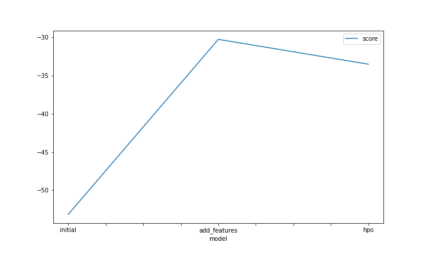
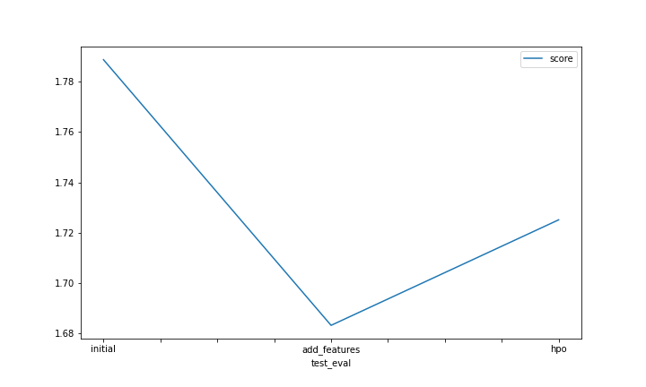

# Report: Predict Bike Sharing Demand with AutoGluon Solution
#### OLYMPIAH OTIENO

## Initial Training
### What did you realize when you tried to submit your predictions? What changes were needed to the output of the predictor to submit your results?
After my first training, I realized that before sumbmitting your predictions you had to ensure that all the outputs should not be negative. 
      I eliminated the negative values by setting all the negative values to zero.

### What was the top ranked model that performed?
WeightedEnsemble_L3 

## Exploratory data analysis and feature creation
### What did the exploratory analysis find and how did you add additional features?
I was able to note the following from the EDA:
  1.The distribution graphs of "temp" and "atemp" are approximately  normally distributed.
  2.The distribution graphs of the features "windspeed" and "count" appears to be rightly-skewed.
  3.The distribution graph of humidity is slightly skewed to the left.
  4.The feature columns for 'working day' and 'holiday' are binary(0,1).
  5.There was an increase in bike share demands during the season of fall and its was the lowest in spring.
  6.The number of bike rentals was higher during the clear with few clouds (weather_1) and lowest during light snow and light rain (weather_3).
  7.From the correlation matrix it was evident that temp and atemp are highly related, casual and working day are highly inversely related etc.
  8.There was a high increase in the bike share demand during summer.
I added new features based on the notebook incentive. The added features, included hour ,day and month.

### How much better did your model preform after adding additional features and why do you think that is?
After adding features the best models score_val ,based on rsme metric, increased from -50.14 to -30.25. 
This supports principle in this case which is the higher_the_better.
I think adding additional features provided the model with more relevant data to train and evaluate on thus helped the model improve drastically. 

## Hyper parameter tuning
### How much better did your model preform after trying different hyper parameters?
After trying different hyperparameters, the model there was a slight improvement compared to the previous model with default hyperparametrs. This is because some of the hyperparameters did not add any value to the model but rather contributed in its poor performance.

### If you were given more time with this dataset, where do you think you would spend more time?
I would spend more time in  exploratory data analysis before any form of training. This is to get insights on the data i.e. normalization, outliers, bike ride count distribution per feature etc. Another step I would take my time in is feature engineering because It greately contributes to the outcome of the model(performance). Feature engineering will enable me to pick the most relevant features for the model and as a result prepare the features in a suitable way for the model.

### Create a table with the models you ran, the hyperparameters modified, and the kaggle score.
|model|hpo1|hpo2|hpo3|score|
|--|--|--|--|--|
|initial|default|default|GBM : num_boost_round, num_leaves, learning_rate, feature_fraction_bynode, saved_feature_importance_type|1.78883|
|add_features|default|default|CAT : iterations, learning_rate, depth|1.68304|
|hpo|default|default|XGB : n_estimators, max_depth, eta , alpha, tree_method|1.72506|

### Create a line plot showing the top model score for the three (or more) training runs during the project.

TODO: Replace the image below with your own.

### Create a line plot showing the top kaggle score for the three (or more) prediction submissions during the project.

TODO: Replace the image below with your own.

## Summary
In summary, the project helped me showcase my understanding of the ML workflow. It also shows how the use of an AutoMl can fasten the whole ML cycle by automating the processing, creating and tuning of an ML model. Although there was not so much of hyerparameter tuning, it is evident that it can help improve the performance of a model so long as it is done in the right way (not forgetting that it is an iterative process that requires patience). Lastly, the results were okay for a first timer but there can be improvement with other trials in order to get a better Kaggle score i.e close to the scores of the leaders in the leaderboard for this competition.

